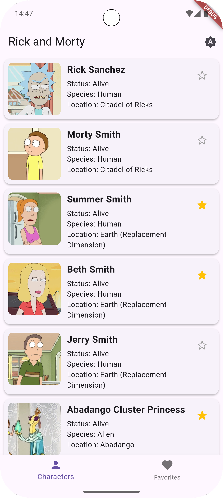
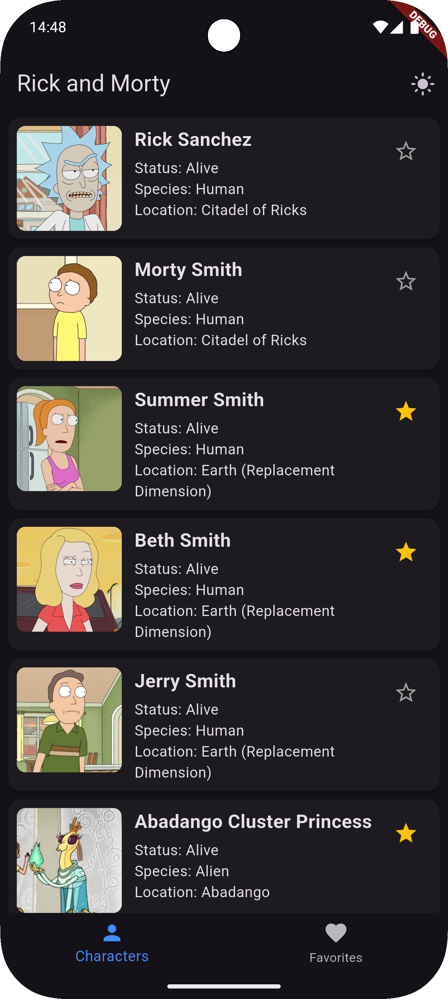
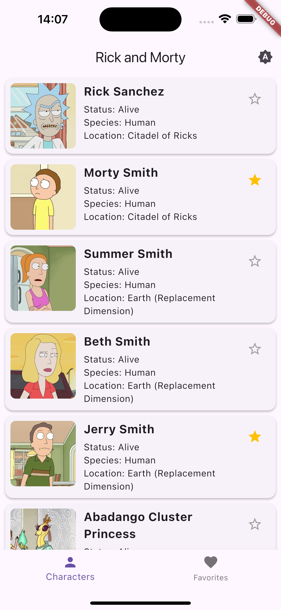
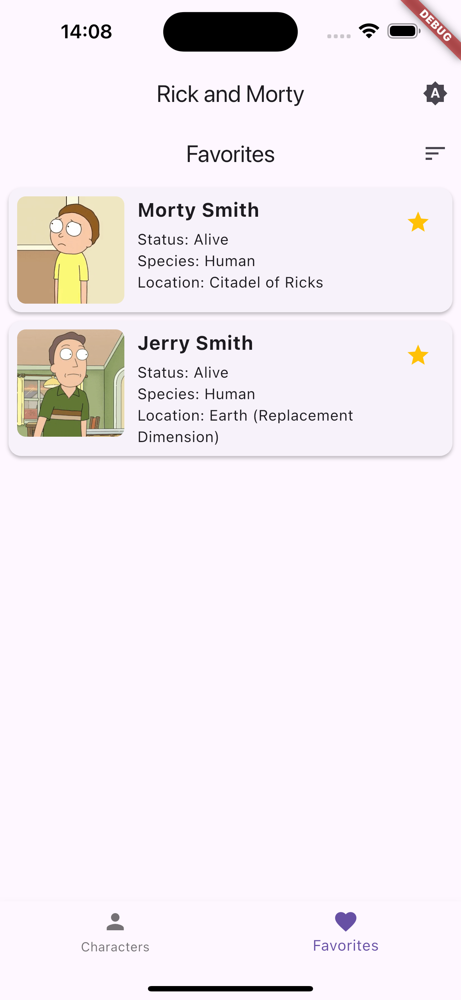

# Тестовое задание для Effective Mobile (Flutter)
# Список персонажей Рика и Морти

## Описание
Данное приложение реализовано согласно техническому заданию.

## Ссылки
- [Техническое задание](docs/Тестовое%20задание%20Flutter.docx)
- [Ссылка на документацию API](https://rickandmortyapi.com/documentation/)

## Скриншоты

Android:
<table>
  <tr>
    <td></td>
    <td></td>
    <td></td>
  </tr>
</table>

iOS:
<table>
  <tr>
    <td></td>
    <td></td>
    <td></td>
  </tr>

</table>

## Разработчик
**Шакуров Денис Дамирович**